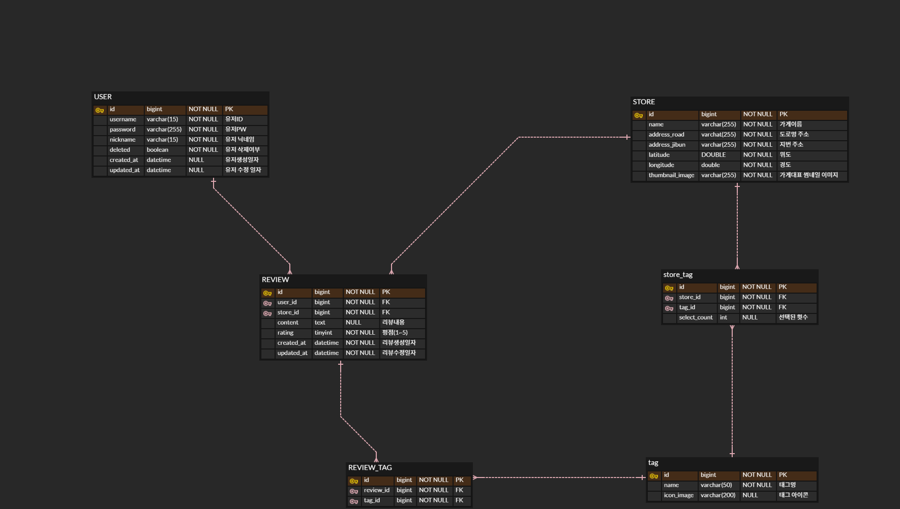

# 🍺 술지도 (Suljido) - 사용자 참여형 술집 큐레이션 서비스
> **Service Link:** [https://suljido.kcksh.site/](https://suljido.kcksh.site/)  
> **Status:** 🚀 In Development (JPA & Spatial Data Engineering 학습용 프로젝트)

## 1. Project Goal (기획 의도)
- **개인화된 장소 공유:** 단순한 맛집 검색을 넘어, 사용자가 직접 큐레이션한 '자주 가는 술집' 정보를 공유하는 위치 기반 커뮤니티 서비스 구축
- **기술적 도전:** Legacy(MyBatis) 환경을 벗어나 **Modern Java Tech Stack(Spring Data JPA)** 및 **공간 데이터(Spatial Data)** 처리 기술 습득

## 2. System Architecture (아키텍처)
> **Front-End(Netlify)와 Back-End(AWS)를 분리하고,CI/CD 파이프라인을 구축하여 배포 자동화를 구현했습니다.**
> **최적의 비용구성을 위해 최대한 무료 서비스를 이용하여 아키텍처를 구축하였습니다.**

* **Infrastructure:** 클라우드 서버는 AWS EC2,AWS RDS,AWS OpenSearch 를 이용했습니다.
* **Security:** Spring Security& JWT & OAuth2(Kakao)를 통해 인증 인가 로직을 중앙화했습니다.
* **Deploy:** GitHub Actions를 활용하여 Main 브랜치 푸시 시 자동 배포되도록 구성했습니다.

## 3. Tech Stack (기술 스택)
- **Backend:** Java 17, Spring Boot 3.x, Spring Data JPA
- **Database:** MySQL 8.0 (Spatial Index), ElasticSearch
- **Infrastructure:** AWS EC2 (or 사용중인 서버환경 기재), AWS OpenSearch, Netlify, AWS RDS , Docker
- **External API:** Kakao Map API

## 4. ERD & Data Structure (데이터 설계)
> **공간 데이터(Point) 활용 및 JPA 연관 관계를 고려하여 설계를 최적화했습니다.**

* **Spatial Data:** `Store` 테이블의 좌표 컬럼에 **Spatial Index**를 적용하여 반경 검색 성능을 최적화했습니다.
* **JPA Relation:** `User`와 `Review`, `Store` 간의 다대일(N:1) 관계를 매핑하여 객체 지향적인 설계를 지향했습니다.

## 5. Key Engineering & Learnings (핵심 기술 및 문제 해결)

### 📍 MySQL Spatial Data를 활용한 위치 기반 검색
- **문제:** 단순 위도/경도(`double`) 데이터 조회 시, 반경 검색 쿼리의 성능 저하 및 복잡성 인지
- **해결:** MySQL의 **`Point` 타입**과 **공간 인덱스(Spatial Index, R-Tree)**를 적용하여 지리 정보 처리를 최적화
- **구현:** `ST_Distance_Sphere` 함수를 활용하여 사용자 위치 기준 반경 N km 내의 데이터를 효율적으로 조회하는 로직 구현

### 🏗️ JPA/ORM을 통한 생산성 및 데이터 무결성 확보
- **도전:** 기존 MyBatis 사용 시 반복되던 CRUD 쿼리 작성 비용 절감 필요
- **해결:** Spring Data JPA 도입으로 **Repository 패턴**을 적용, 비즈니스 로직 집중도 향상

### 🗺️ Kakao Map API 연동 및 마커 클러스터링
- 프론트엔드와 좌표 데이터를 주고받으며 지도 위에 POI(Point of Interest)를 시각화하는 전체 파이프라인 구축

## 4. Dev Log (개발 일지)
* 2025.12.08 사용자 기준 근처 맛집 찾기 기능 도입
* 2025.12.15 `@loginuser` 신규 생성 으로 리뷰 등록시 사용자 정보 등록 도입
* 2025.12.24 OpenSearch 를 이용한 등록된 가게명 자동완성 기능 구현
* 2025.12.29 세션 로그인 방식->JWT 로그인 방식으로 전환
